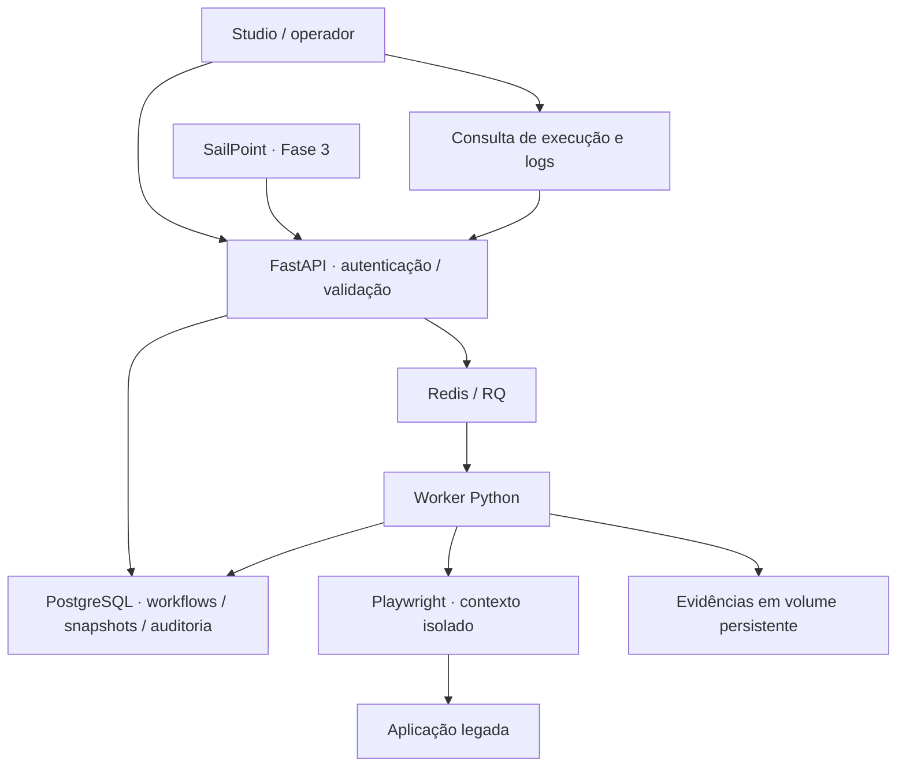

# Arquitetura e decisões — v0.1

## 1. Arquitetura de referência

Monólito modular para controle/API, workers separados para execução. Uma imagem Python compartilhada
no MVP, processos diferentes. Interface servida pelo FastAPI; Nginx é a entrada `frontend` no Compose.
React Flow passa a ser um cliente dessa API na Fase 2, sem mover a lógica de execução ao navegador.

## 2. Diretórios

- `backend/app/api`: transporte HTTP e permissões.
- `backend/app/core`: configuração, sessões SQLAlchemy, fila e segurança.
- `backend/app/models`: entidades persistidas.
- `backend/app/schemas`: contrato validado das ações e requisições.
- `backend/app/services`: criação de execução e auditoria transacional.
- `backend/app/rpa`: browser manager, engine, resolução de variáveis e seletores.
- `backend/app/rpa/actions`: implementação das ações suportadas.
- `backend/app/integrations/sailpoint`: documentação do ponto de extensão; sem endpoints fictícios.
- `backend/app/templates` e `static`: cliente web real, módulos JS e CSS local.
- `worker`: loop RQ e processamento de jobs.
- `recorder`: agente desktop local e captura DOM.
- `demo`: aplicação fictícia independente e workflow CREATE_ACCOUNT.
- `migrations`: schema evolutivo Alembic.
- `tests`, `docker`, `scripts`, `docs`: validação, distribuição e operação.

## 3. Modelo de banco

| Entidade | Dados e vínculos |
|---|---|
| users | UUID, username único, hash Argon2, papel, ativo |
| applications | UUID, nome único, URL, ambiente, browser, timeout, headless, tags |
| workflows | UUID, application_id FK, operação, etapas JSON, revisão, timeout, timestamps |
| executions | UUID, workflow_id FK, created_by FK, snapshot, entrada cifrada, status, output, worker, correlação, chave idempotente única, timestamps |
| execution_logs | ID incremental, execution_id FK, etapa, evento, detalhes, timestamp |
| audit_events | ator, evento, entidade, IP, resumo não sensível e timestamp |

Etapas ficam em JSON para que atualização do workflow seja atômica. A validação Pydantic limita
quantidade, tipos, seletores, IDs e timeouts. Extração para tabela `workflow_steps` não é necessária
na primeira fase. O snapshot da execução torna sua interpretação independente da edição corrente.
`revision` evita lost updates; não representa publicação ou histórico completo de versões.

Índices: status/correlação/workflow nas execuções, aplicação nos workflows e execução nos logs.
Datas em UTC. A UI converte para fuso do navegador; "hoje" no dashboard começa em 00:00 UTC.

## 4. Componentes e fronteiras

- API não executa Playwright nem aceita Python/JavaScript de usuário.
- Worker recebe apenas UUID; lê snapshot e entrada cifrada do banco.
- Fila usa serializador JSON do RQ, não pickle. Redis é serviço interno confiável.
- Browser manager cria contexto novo por job e fecha o browser em `finally`.
- Engine mantém variáveis em memória, emite eventos e devolve saída explícita de extração.
- Auditoria e logs registram metadados; não valores digitados ou mensagens brutas de exceção.
- Vault persistente será um serviço separado; o ciframento da entrada já usa Fernet nesta fase.

## 5. SailPoint → RPA → legado

Contrato de referência: operação/aplicação → workflow publicado → execução/job → worker → resultado.
A chamada recebe um ID após enfileirar. `202` não significa criação de conta concluída.
O adaptador deverá lidar com polling/callback, normalização de schema e limites de timeout do conector.
Ver `SAILPOINT.md`.

## 6. Recorder

Painel local → start autenticado pela origem loopback → Chromium headed → binding de captura DOM →
lista em memória → stop → export JSON → import/revisão no designer → validação ao salvar.

Não há CORS para origens remotas. Host e Origin são restritos a `127.0.0.1:8877`.
O painel não é publicado junto ao backend. Campo preenchido é convertido em variável dentro do
browser antes de emitir o evento. Os valores reais não entram no JSON. Apenas aba principal/DOM comum.

## 7. Workflow Engine

1. Worker faz claim atômico `QUEUED → RUNNING`.
2. Decifra entrada e carrega snapshot.
3. Browser e contexto são abertos com configuração da aplicação.
4. Verifica cancelamento, resolve variável sem avaliação de código.
5. Procura seletor único/visível em ordem; alternativa bem-sucedida gera evento específico.
6. Executa ação com timeout; persiste eventos por etapa.
7. Em erro: tenta screenshot mascarado e estrutura mínima da página; não armazena HTML completo.
8. Fecha browser e grava estado terminal; apaga entrada cifrada.

Estados nesta fase: `QUEUED`, `RUNNING`, `SUCCESS`, `FAILED`, `TIMEOUT`, `CANCELLED`.
`PENDING` existe como default do modelo para evolução, mas não é usado no fluxo API atual.
Retry automático está ausente para não repetir criação após sucesso parcial.
Screenshot não é possível se o browser falhar antes de abrir uma página; a ausência é registrada.

## 8. Tecnologias

Python 3.12, FastAPI, Pydantic 2, SQLAlchemy 2, PostgreSQL 16, Alembic, Redis 7, RQ 2,
Playwright, Jinja2, JavaScript ES modules, CSS responsivo, Nginx.
`requirements.lock` fixa a instalação validada. pytest, fakeredis e testes com Chromium são ferramentas de verificação.

## 9. Segurança

JWT curto em memória, Argon2id, RBAC, validação de entrada sem campos extras, ciframento e limpeza
de entrada, CSP, sem cookies de sessão da plataforma, rate limiting, artefatos autenticados,
allowlist de origens e isolamento de sessões. Detalhes e lacunas em `SECURITY.md`.

## 10. Sequência de evolução

Fase 1 executável → designer gráfico/controle de fluxo e persistência confiável → adaptador SailPoint →
agregações/pools → operação enterprise. Matriz de entregas em `ROADMAP.md`.

Referências técnicas consultadas:
- https://playwright.dev/python/docs/library
- https://python-rq.org/docs/
